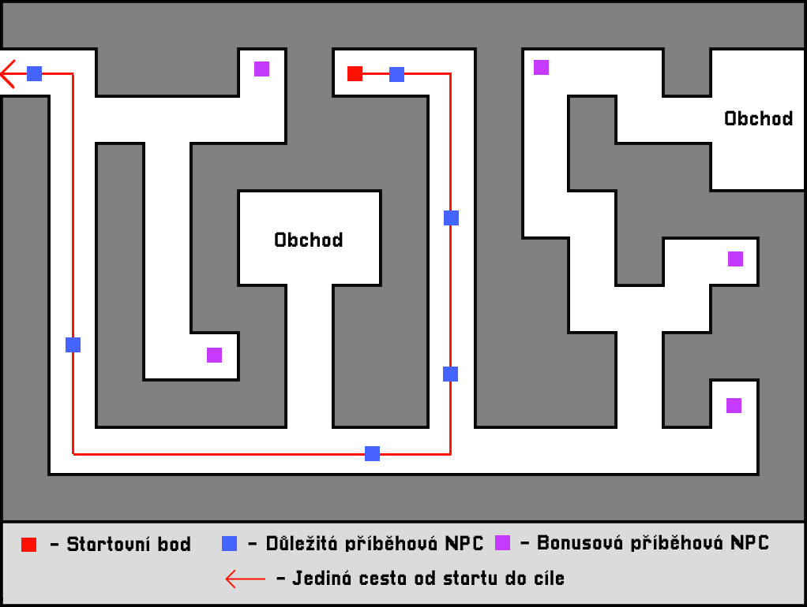
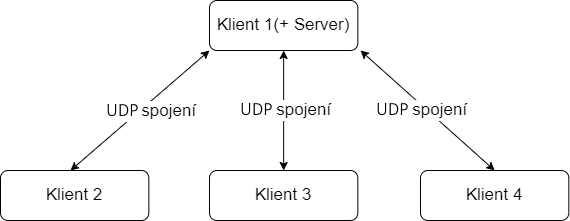

# Rámcová analýza
## Stručná verze projektového záměru
Jako svůj projekt bych chtěl udělat příběhovou multiplayer hru, ve které bude cílem utéct z náhodně generovaného bludiště. Hráči se budou moct připojit na jednoho z clientů a hrát na dálku, nebo budou moct hrát i sami.
## Rozsah realizace projektu

Po zapnutí hry bude hráč v hlavním menu kde si bude moct nastavit rozlišení a zvuky, nebo spustit hru. Pokud hru spustí bude moct vytvořit novou hru, nebo načíst již rozehranou. Když bude vytvářet novou hru, vybere si zda chce hrát sám a nebo multiplayer. Pokud si vybere, že chce založit multiplayer hru, může si nastavit port, heslo, max počet hráču. Poté co se takto vytvoří hra, vytvoří se lobby na lokální ip adrese se zadaným portem. Jak adresu zpřístupnit ostatním hráčům si musí hráč vyřešit sám. Například to mohou udělat pomocí veřejné ip adresy nebo pomocí toho, že budou na stejné wifi. Pokud se tedy hráči dostanou na tuto adresu mohou se na server připojit. Až budou všichni hráči připojeni, hru spustí hostitel. Tento hostitel bude tedy zároveň server a zároveň client. Pokud si hráč vybere že by chtěl pokračovat v již rozehranné hře, tak vybere jednu z uložených her. Pokud vybere multiplayer hru, hráči si budou muset vyberat, kteří z hráčů byli oni. Jakmile je hra spuštěna, půjde kdykoli přerušit a uložit. A teď už tedy k samotné hře. Hra bude vždy náhodně vygenerované bludiště a za cíl bude z něj utéct. Na cestě ale budu moct potkávat různá NPC, se kterými si budu moct povídat a budou mi vlastně odhalovat příběh, co se stal. Takže mým cílem bude zároveň i zjistit, co se tam vlastně stalo. Dále ale budou v bludišti chodit nepřátelé, proti kterým budu muset bojovat. Taky budu moct potkat obchody, ve kterých budu v bezpečí před monstry a budu si zde moct koupic nějaké věci. A jako poslední bych měl asi zmínit, že bludiště ze kterého budu utíkat, nebude rozdělené na místnosti, ale měly by to být doopravdy chodby ve kterých budu chodit. Jedinou výjimkou jsou již zmíněné obchody. To jak si to představuji, je vyzobrazeno na obrázku výše. Délka jedné hry by mohla být něco okolo 2 hodin.
## Technologický stack a zdůvodnění výběru daných technologí
Hru bych programoval v programovacím jazyce ***C#***, protože v tomto jazyce pracuji už velmi dlouho. Abych hru nemusel dělat v konzoli použil bych na to framework ***MonoGame***. Tento framework bych použil ze stejného důvodu jako ***C#***, už v něm pracuji dlouho a tak jsem na něj zvyklý. A jako poslední bych používal ***UDP*** packety, protože mi připadají pro tento projekt vhodnější než TCP spojení.
## Hrubá časová osa zpracování projektu
| Měsíc | Milník |
| --- | :---: |
| Leden | Základ hry (Bludiště se vygeneruje, hráči se budou moct připojit na server) |
| Únor | Přidání monster, dokončení kolizí, základní bojový systém |
| Březen | Přidám obchody a rozšířím monstra a zbraně |
| Duben | Začnu dělat příběh a příběhová NPC |
| Květen | Grafika hry, Dokončení příběhu hry |
| Červen | Poslední úpravy (Efekty, chyby, zvuky, atd...) |
## Diagram
